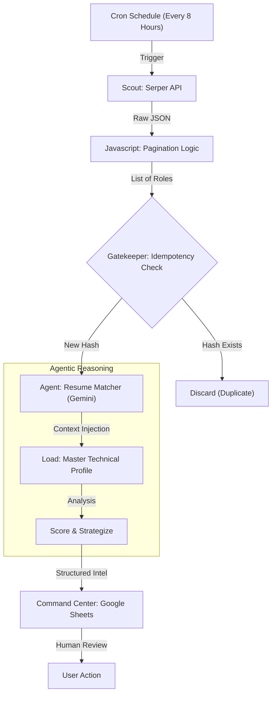

# 🤖 Agentic Job Market Intelligence (n8n)


### A Self-Hosted "Recruiter Agent" that Scouts, Filters, and Strategizes.

## 📖 Overview

Traditional job hunting is a "Brute Force" problem: huge search volume, low relevance, and high manual effort. Existing alerts (LinkedIn/Indeed) rely on keyword matching, often missing the nuance of a senior technical profile.

This project solves the **"Last Mile"** problem of job intelligence. It is an **Agentic Workflow** that doesn't just "find" jobs—it "reasons" about them. It acts as a specialized Recruiter Agent that:

1. **Scouts** hidden roles using complex boolean logic across multiple ATS platforms (Lever, Greenhouse, Workday, Taleo, iCIMS).
2. **Evaluates** fit against a 10-year Senior Technical Architect profile using **Google Gemini** reasoning.
3. **Strategizes** the application by identifying "Hidden Requirements" and drafting tailored resume bullets.
4. **Reports** high-signal opportunities to a centralized "Command Center" (Google Sheets).

## 💡 Why Another Job Search Agent?

*Aren't there hundreds of n8n job scrapers already?*

Yes, but most of them are **Aggregators**. They fetch data and dump it into a row.

This project is designed for **Senior/Complex Profiles** where keyword matching isn't enough.

* **The Problem:** A generic scraper sees "Product Manager" and saves it.
* **This Agent:** Sees "Product Manager," notices it requires "Security Clearance" (which you don't have), and discards it. Or it sees a "Solutions Engineer" role that asks for your *exact* rare tech stack and flags it as a "Unicorn" opportunity.

**Key Differentiators:**

1. **Idempotency:** Uses MD5 hashing to prevent processing the same job twice (crucial for keeping LLM costs near zero).
2. **Resume Strategy:** It doesn't just find the job; it writes the specific bullet points you need to land it.
3. **Complex Reasoning:** It handles logic like *"I have 8 years total, but only 3 in Product"*—a nuance standard filters miss.

### 🤝 Related Community Patterns

If this workflow is too complex for your needs, check out these excellent alternatives from the n8n community:

* **[Simple LinkedIn Scraper](https://n8n.io/workflows/9240-daily-linkedin-job-alerts-with-apify-scraper-google-sheets-and-gmail/)**: Good for high-volume, low-filter searches.
* **[Upwork RSS Notifier](https://n8n.io/workflows/9020-track-upwork-jobs-from-vollna-rss-with-google-sheets-logging-and-slack-alerts/)**: Best for freelancers looking for gig work.
* **[AI Job Application Sender](https://n8n.io/workflows/6391-ai-powered-automated-job-search-and-application/)**: If you want to automate the *sending* (use with caution!).

... [EASY Self-Hosted n8n Tutorial | Automate AI Agents, Notion & More!](https://www.youtube.com/watch?v=7OXgJ0F1kDQ) ...

This video is relevant because it walks through setting up a self-hosted n8n instance and building your first AI agent, which perfectly complements the "Home Lab" and "Agentic" themes of your project.

## 🏗️ Architecture

The system operates as a **Decision Pipeline** utilizing a "Hybrid" Low-Code/Pro-Code approach. It leverages **Self-Hosted n8n** for orchestration and raw **JavaScript** for complex data manipulation.



### Core Components

* **The Scout (Serper API):** Performs complex boolean searches (e.g., `site:greenhouse.io ("Data Product" OR "Technical Product")`) to find "Zero-Day" listings that standard aggregators miss.
* *Note:* Uses a custom **JavaScript Code Node** for pagination handling to bypass standard API limits.


* **The Gatekeeper (MD5 Hashing):** Implements **Idempotency**. Every job URL is hashed; if the hash exists in the Google Sheet database, the flow stops. This prevents redundant AI processing and saves costs.
* **The Brain (Google Gemini):**
    * **Context Injection:** Dynamically loads a "Master Profile" (Skills, Experience, Preferences) from JSON nodes.
    * **Reasoning Engine:** Scores roles based on "Hidden Requirements" (e.g., specific cloud stacks not explicitly in the title) and rigid constraints (e.g., Visa Status).
    * **Output:** Generates a JSON object containing a "Tailored Summary," "Gap Analysis," and "Resume Enhancement Strategy."


* **The Command Center (Google Sheets):** Acts as the frontend database, presenting high-signal opportunities for human review.

## 🚀 Getting Started

### Prerequisites

* **Node.js** (v18+) installed on your machine.
* **n8n** (Self-hosted via `npm`).
* **Google Gemini (PaLM) API Key**.
* **Serper.dev API Key** (Google Search API).
* **Google Cloud Project** (Enabled for Sheets API).

### Installation (Windows/Node.js "Bare Metal")

Since this agent runs directly on the host machine (no Docker), follow these specific steps to ensure the Code Nodes can access your secure keys.

1. **Install n8n Global Package:**
```bash
npm install n8n -g

```


2. **Set Environment Variables (Crucial):**
You must enable access for the Code Nodes to read your API keys.
* Press `Windows Key`, type "env", and select **Edit the system environment variables**.
* Click **Environment Variables**.
* Under **User variables**, add:
* **Name:** `N8N_BLOCK_ENV_ACCESS_IN_NODE` | **Value:** `false`
* **Name:** `SERPER_API_KEY` | **Value:** `your_serper_key_here`


* *Note:* You must restart your terminal after setting these for n8n to see them.


3. **Start n8n:**
```bash
n8n start

```


4. **Import Workflow:**
* Open your dashboard (`http://localhost:5678`).
* Go to **Workflows** > **Import from File**.
* Select `workflows/agentic-job-search.json`.


## ⚙️ Configuration (Required)

After importing the workflow, you must configure **3 key areas** in the n8n canvas to match your environment.

### 1. Google Sheets Connection (The Database/CRM)

To ensure the "Command Center" works, you must link your Sheet.

1. **Create the Sheet:** Create a new Google Sheet.
2. **Get the ID:** Copy the long string in your browser URL (e.g., `19pEgDS4QBVr-EMUVCKzjOrcbuEIS...`).
3. **Update Nodes:**
* Open the node **`Query Job Search Database`**.
* Paste your ID into the **Document ID** field (or use "From List" if you authenticated OAuth2).
* Repeat for **`Update Job Search Database`** and **`Update row in sheet`**.


### 2. Resume Context (The Data)

The workflow uses **"Set" Nodes** to hold different versions of your resume as JSON strings. This allows the AI to "read" your background.

* Locate the nodes named **`Set Resume - Product Manager`**, **`Set Resume - Product Owner`**, etc.
* Open each one.
* Paste your specific resume text into the `resume_text` value field.

### 3. AI Persona Tuning (The Logic)

The AI Agents (`AI - Is Job Relevant?`) contain the strict logic for evaluating candidates.

* Open the Gemini Chat node.
* Edit the **System Message** to reflect *your* specific constraints.
* *Example:* Update "H4" to your specific visa status.
* *Example:* Update "MBA" to your degree/certification.


## 📋 Google Sheets Schema

**Contract:** Your Google Sheet **MUST** have these exact headers in **Row 1** for the automation to write data correctly.

| Col | Header Name | Data Type | Description |
| --- | --- | --- | --- |
| **A** | `Job_Hash` | String | **(Primary Key)** MD5 hash of the URL to prevent duplicates. |
| **B** | `Date_Found` | Date | Timestamp when the agent found the role. |
| **C** | `Date_Posted` | Text | Recency (e.g., "2 days ago", "Just now"). |
| **D** | `Location` | Text | e.g., "Remote", "New York, NY". |
| **E** | `Source` | Text | ATS Platform (Lever, Greenhouse, etc.). |
| **F** | `Company` | Text | Hiring company name. |
| **G** | `Title` | Text | Job Title. |
| **H** | `Category` | Text | **[AI]** Classification (e.g., "Data PM", "Mismatch"). |
| **I** | `Match_Score` | Number | **[AI]** 0-100 Suitability Score. |
| **J** | `URL` | Link | Direct application link. |
| **K** | `Justification` | Text | **[AI]** Reasoning for the score. |
| **L** | `Pitch` | Text | **[AI]** 1-sentence "Hook" connecting bio to role. |
| **M** | `Resume Focus` | Text | **[AI]** Keywords to highlight. |
| **N** | `Tailored Summary` | Text | **[AI]** A generated Professional Summary ready for copy-paste. |
| **O** | `Enhanced Bullets` | Text | **[AI]** 3 suggested resume bullets using strong action verbs. |
| **P** | `Action Plan` | Text | **[AI]** Specific instructions to fix resume gaps. |
| **Q** | `Critical Gaps` | Text | **[AI]** Hard skills missing. |
| **R** | `Match Verdict` | Text | **[AI]** "High", "Medium", or "Low". |
| **S** | `Status` | Text | **[Human]** Dropdown (e.g., "Applied", "Rejected"). |

## 🛠️ Customization & Security

### Customizing the Search

To change the target roles, edit the **`Code in JavaScript`** node (typically named "Query Serper").

* Modify the `q` variable:
```javascript
const query = 'site:lever.co ("Solutions Architect" OR "Pre-Sales")';

```


### Security Best Practices

* **Do not hardcode API Keys:** Use `process.env.SERPER_API_KEY` (or `$env`) inside Code Nodes.
* **Privacy:** This workflow runs locally. Your resume data stays within your network until sent to the Gemini API for processing.

## 📄 License

Distributed under the MIT License.

---

### 👨‍💻 Author

**Pritam Bhowmik**
*Senior Technical Architect | API Management & Integration Specialist*

*Blending Enterprise Governance (Workato/SnapLogic) with Agentic Innovation (n8n).*
